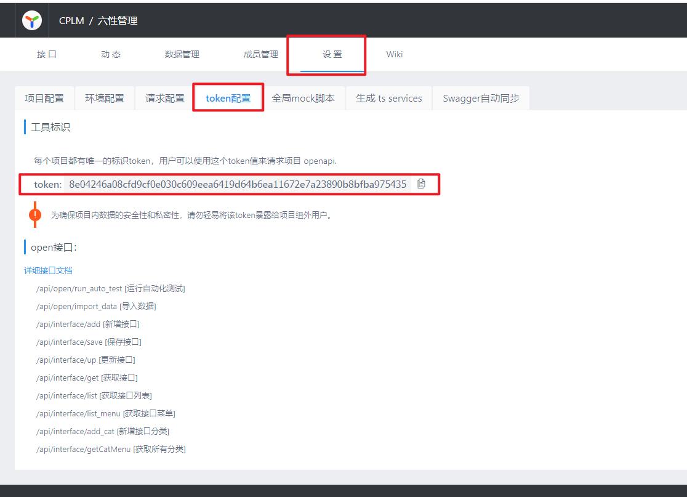

## OpenAPI注解定义
1. Controller类添加注解`@Tag`，并设置属性`name`和`description`
```
@RestController
@Tag(name = "部门", description = "部门接口")
public class DepartmentController {
  ...
}
```
2. Controller方法添加注解`@Operation`并设置属性`summary`
3.  Controller方法包含`Pageable`类参数时，方法上添加注解`@PageableAsQueryParam`，参数上添加注解`@Parameter(hidden = true) `
4. Controller方法包含`@PathVariable`和`@RequestParam`类型参数时，参数上添加注解`@Parameter`并设置属性`description`
```java
@Operation(summary = "部门成员列表")
@PageableAsQueryParam
@GetMapping(value = "/departments/{departmentId}/members")
public ResponseEntity<DepartmentMemberDto> listDepartmentMembers(
    @Parameter(description = "部门ID") @PathVariable String departmentId, 
    @Parameter(description = "成员类型") @RequestParam String memberType, 
    @Parameter(hidden = true) Pageable pageable) {
    ...
  }
```
5. DTO类添加`@ParameterObject`和`@Schema`注解并设置属性`description`，字段添加`@Parameter`和`@Schema`注解并设置属性`description`
```java
@Data
@ParameterObject(description = "部门成员DTO")
@Schema(description = "部门成员DTO")
public class DepartmentMemberDto implements Serializable {

  private static final long serialVersionUID = 1L;

  @Parameter(description = "成员类型")
  @Schema(description = "成员类型")
  private String memberType;

  @Parameter(description = "成员名称")
  @Schema(description = "成员名称")
  private String name;
  
  ...
}
```
## 导入到Yapi
# 环境准备
YAPI地址：http://yapi.corilead.com/
### 1、打开YAPI，找到所属项目

### 2、进入项目详情页，选择设置页 > token配置

### 3、在项目根目录新建文件yapi-import.json
```json
~~~
{
  "type": "swagger",
  "token": "8e04246a08cfd9cf0e030c609eea6419d64b6ea11672e7a23890b8bfba975435",
  "file": "http://localhost:8080/v3/api-docs",
  "merge": "mergin",
  "server": "http://yapi.corilead.com"
}
~~~
```
`type`是数据数据方式，目前官方只支持 swagger
`token`是项目 token，在`项目设置 -> token`设置获取
`file`是 swagger 接口文档文件，可使用绝对路径或 url
`merge`有三种导入方式(v1.3.23+支持) normal, good, mergin

1.  普通模式(normal)：不导入已存在的接口；
2.  智能合并(good)：已存在的接口，将合并返回数据的 response，适用于导入了 swagger 数据，保留对数据结构的改动；
3.  完全覆盖(mergin)：不保留旧数据，完全使用新数据，适用于接口定义完全交给后端定义， 默认为 normal

`server`是 yapi 服务器地址
### 4、安装导入程序
> 前提：需要安装nodejs
```
npm install -g yapi-cli
```
### 5、启动项目
### 6、导入接口到YAPI
在项目根目录执行
```
yai import
```