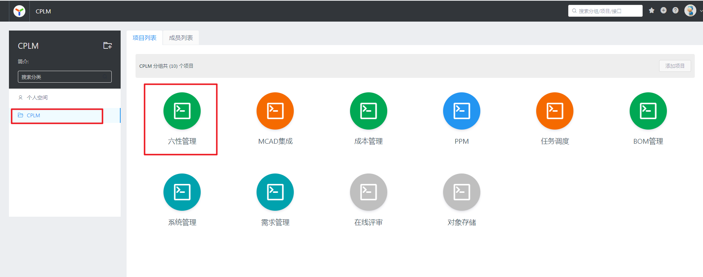
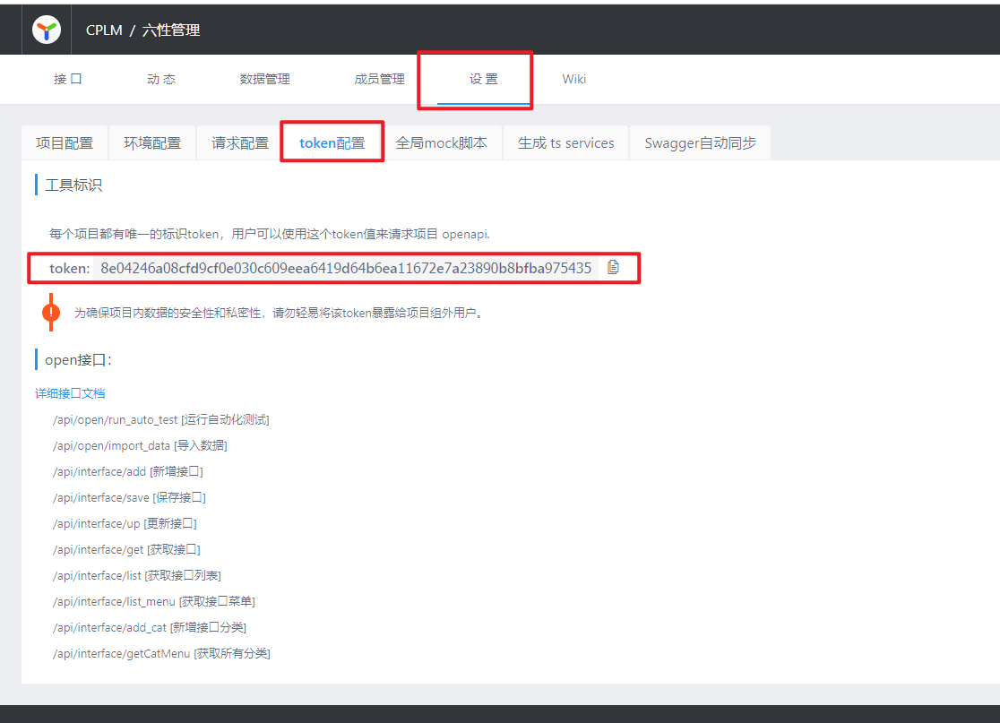

# 环境准备
YAPI地址：http://yapi.corilead.com/
# 接口定义
1、在Controller类添加@Tag注解，设置name和description属性
2、在Controller方法添加@Operation注解，设置summary属性
3、@PathVariable和@RequestParam类型的参数添加@Parameter注解
```java
@RestController
@Tag(name = "六性工作实例接口", description = "六性工作实例接口")
public class CharWorkInstanceController {

  private final CharWorkInstanceService charWorkInstanceService;
  private final CharWorkItemHelper charWorkItemHelper;

  public CharWorkInstanceController(
      CharWorkInstanceService charWorkInstanceService, CharWorkItemHelper charWorkItemHelper) {
    this.charWorkInstanceService = charWorkInstanceService;
    this.charWorkItemHelper = charWorkItemHelper;
  }

  @Operation(summary = "获取工作项实例中的工作项")
  @GetMapping(value = "/char-work-instances/{instanceId}/member", name = "获取工作项实例中的工作项")
  ResponseEntity<TableData> charWorkTemplatePreview(
      @Parameter(description = "工作项模板实例ID") @PathVariable String instanceId) {
    return ResponseEntity.ok().build();
  }

  @Operation(summary = "修改工作实例中的工作项")
  @PostMapping(value = "/char-work-instances/{instanceId}/member", name = "修改工作实例中的工作项")
  ResponseEntity<TableData> charWorkTemplatePreview(
      @Parameter(description = "工作项模板实例ID") @PathVariable String instanceId,
      @RequestBody CharWorkInstanceItemDto form) {
    return ResponseEntity.ok().build();
  }
```
4、DTO类和字段都添加@Schema注解
```java
@Data
@Schema(description = "工作项模板实例成员Dto")
public class CharWorkInstanceItemDto implements Serializable {

  private static final long serialVersionUID = 1L;

  @Schema(description = "工作项模板实例成员LinkId")
  private String id;

  @Schema(description = "可选工作项是否选择")
  private Boolean flag;
}
```
# 接口导入
### 1、打开YAPI，找到所属项目

### 2、进入项目详情页，选择设置页 > token配置

### 3、在项目根目录新建文件yapi-import.json
```json
~~~
{
  "type": "swagger",
  "token": "8e04246a08cfd9cf0e030c609eea6419d64b6ea11672e7a23890b8bfba975435",
  "file": "http://localhost:8080/v3/api-docs",
  "merge": "mergin",
  "server": "http://yapi.corilead.com"
}
~~~
```
`type`是数据数据方式，目前官方只支持 swagger
`token`是项目 token，在`项目设置 -> token`设置获取
`file`是 swagger 接口文档文件，可使用绝对路径或 url
`merge`有三种导入方式(v1.3.23+支持) normal, good, mergin

1.  普通模式(normal)：不导入已存在的接口；
2.  智能合并(good)：已存在的接口，将合并返回数据的 response，适用于导入了 swagger 数据，保留对数据结构的改动；
3.  完全覆盖(mergin)：不保留旧数据，完全使用新数据，适用于接口定义完全交给后端定义， 默认为 normal

`server`是 yapi 服务器地址
### 4、安装导入程序
> 前提：需要安装nodejs
```
npm install -g yapi-cli
```
### 5、启动项目
### 6、导入接口到YAPI
在项目根目录执行
```
yai import
```