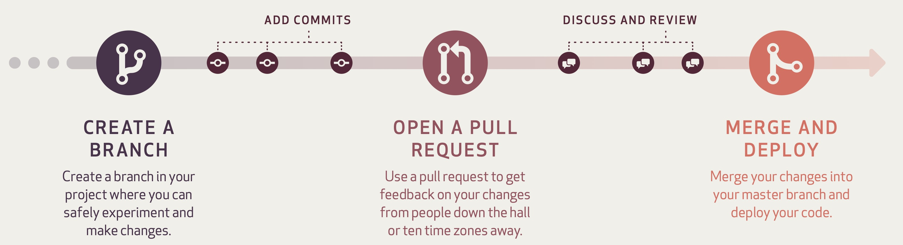

## 流程概述
1. 在仓库中创建分支
2. 创建、编辑、重命名、移动或删除文件
3. 从你的分支新建合并请求，进行代码讨论和审查
4. 根据需要在你的分支上进行更改，合并请求将自动更新
5. 在分支处理就绪可以合并时，由开发负责人合并合并请求
6. 使用合并请求页面的选项或分支页面上的删除按钮删除分支

## 创建分支
## 新建合并请求
## 代码讨论和审查
## 合并合并请求
## 删除分支