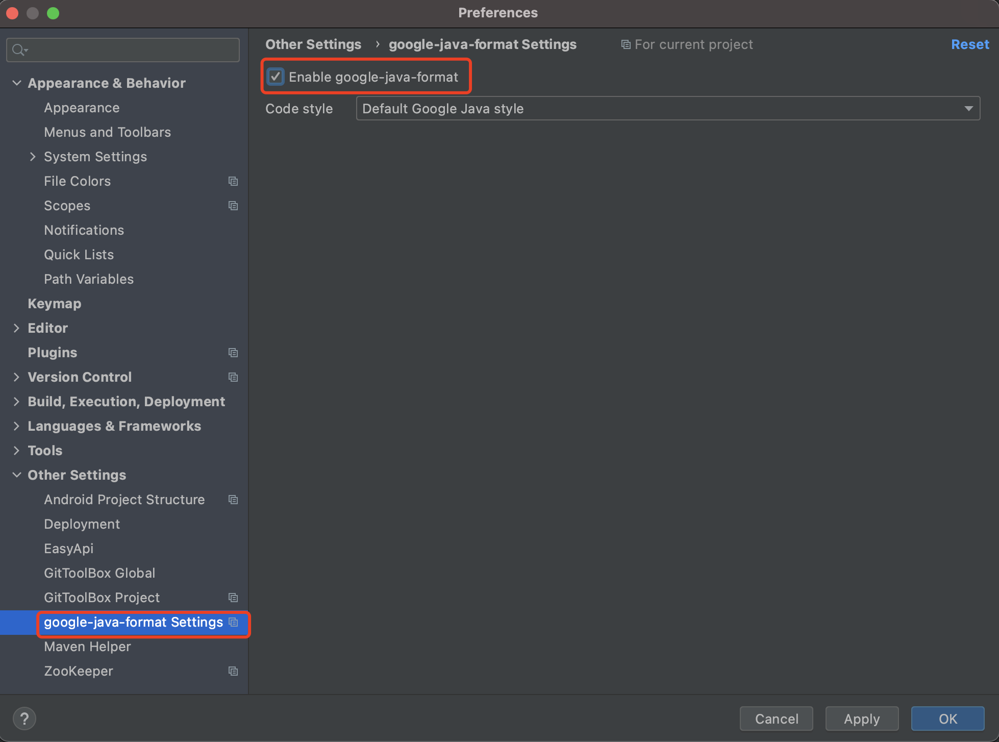

## 基础环境
* 安装[Git](https://git-scm.com/downloads)

## 前端开发环境
* 下载并安装Node.js
* 下载并安装Yarn
* 下载并安装Visual Studio Code

## Java开发环境
### OpenJDK
* 下载OpenJDK并安装
* 设置环境变量
```bash
JAVA_HOME=
PATH=%JAVA_HOME%\bin;...
```

### Apache Maven
* 下载[Maven安装文件](https://maven.apache.org/download.cgi)并解压
* 设置环境变量
```
M2_HOME=D:\apache-maven-3.6.3
PATH=%M2_HOME%\bin;...
```
* 检查Maven安装成功
打卡命令行窗口，执行命令
```
mvn -version
```
* 新建Maven配置文件settings.xml,并保存到$HOME/.m2/
  - Windows默认路径C:\Users\username\\.m2\settings.xml
  - Mac默认路径~/.m2/settings.xml
  - username和password部分需要替换为实际用户名和密码
* 文件内容如下
```xml
<?xml version="1.0" encoding="UTF-8"?>
<settings xmlns="http://maven.apache.org/SETTINGS/1.0.0" xmlns:xsi="http://www.w3.org/2001/XMLSchema-instance" xsi:schemaLocation="http://maven.apache.org/SETTINGS/1.0.0 http://maven.apache.org/xsd/settings-1.0.0.xsd">
  <servers>
    <server>
      <id>cplm-releases</id>
      <username>xxx</username>
      <password>xxx</password>
    </server>
    <server>
      <id>cplm-snapshots</id>
      <username>xxx</username>
      <password>xxx</password>
    </server>
  </servers>
  <mirrors>
    <mirror>
      <id>mirror</id>
      <mirrorOf>central,jcenter,!cplm-releases,!cplm-snapshots</mirrorOf>
      <name>mirror</name>
      <url>https://maven.aliyun.com/nexus/content/groups/public</url>
    </mirror>
  </mirrors>
  <profiles>
    <profile>
      <id>cplm</id>
      <repositories>
        <repository>
          <id>cplm-releases</id>
          <url>http://packages.corilead.com/artifactory/cplm-releases/</url>
          <releases>
            <enabled>true</enabled>
          </releases>
          <snapshots>
            <enabled>false</enabled>
          </snapshots>
        </repository>
        <repository>
          <id>cplm-snapshots</id>
          <url>http://packages.corilead.com/artifactory/cplm-snapshots/</url>
          <releases>
            <enabled>false</enabled>
          </releases>
          <snapshots>
            <enabled>true</enabled>
          </snapshots>
        </repository>
      </repositories>
      <pluginRepositories>
        <pluginRepository>
          <id>cplm-releases</id>
          <url>http://packages.corilead.com/artifactory/cplm-releases/</url>
          <releases>
            <enabled>true</enabled>
          </releases>
          <snapshots>
            <enabled>false</enabled>
          </snapshots>
        </pluginRepository>
        <pluginRepository>
          <id>cplm-snapshots</id>
          <url>http://packages.corilead.com/artifactory/cplm-snapshots/</url>
          <releases>
            <enabled>false</enabled>
          </releases>
          <snapshots>
            <enabled>true</enabled>
          </snapshots>
        </pluginRepository>
      </pluginRepositories>
    </profile>
  </profiles>
  <activeProfiles>
    <activeProfile>cplm</activeProfile>
  </activeProfiles>
</settings>
```

### IntelliJ IDEA
* 下载IDEA并安装
* 安装插件
    - Lombok(新版本IDEA已经内置，不需要手动安装)
    - google-java-format
    - Alibaba Java Coding Guidelines
    - Maven Helper
    - GitToolBox
* 启用google-java-forma插件

## .Net开发环境
* 下载并安装Visual Studio Community 2017

## Golang开发环境
### 安装Go
**MAC OS**
```
brew install go
```
* 更新终端初始化脚本(如`.bashrc`或`.zshrc`)，添加以下内容
```sh
export GOPATH=$HOME/go
export PATH=$PATH:$GOPATH/bin
export GOPROXY=https://mirrors.aliyun.com/goproxy/
```
**CentOS**
```
sudo yum group install "Development Tools"
sudo yum install -y wget libpng12
sudo rm -rf /usr/local/go
wget https://dl.google.com/go/go$VERSION.$OS-$ARCH.tar.gz
sudo tar -C /usr/local -xzf go$VERSION.$OS-$ARCH.tar.gz
```
* 更新终端初始化脚本(如`.bashrc`或`.zshrc`)，添加以下内容
```
export GOPATH=$HOME/go
export PATH=$PATH:$GOPATH/bin
export PATH=$PATH:/usr/local/go/bin
```
### GoLand

## Python开发环境
