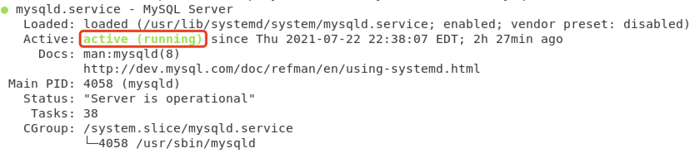
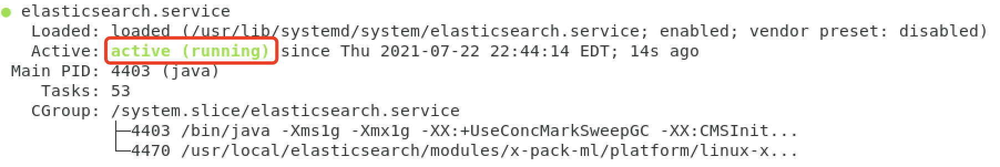
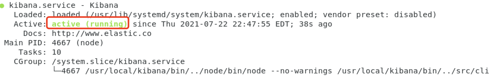
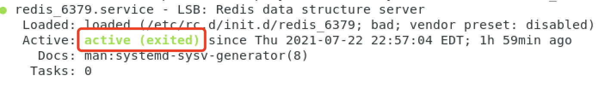
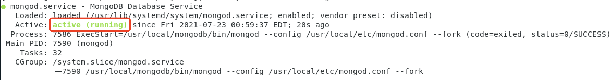
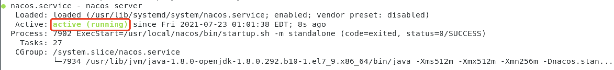

## 部署说明

## 在线部署
1. 克隆部署脚本
```
git clone --depth 1 http://git.corilead.com/cplm/cplm-cloud-deployment.git
```
以 root 用户执行安装命令
```
cd cplm-cloud-deployment
curl quick-install.sh | sh
```
## 离线部署
### 下载安装文件
* [部署脚本](http://git.corilead.com/cplm-saas/cplm-cloud-deployment/-/archive/master/cplm-cloud-deployment-master.zip)
* [MySQL 8](https://dev.mysql.com/get/Downloads/MySQL-8.0/mysql-8.0.26-1.el7.x86_64.rpm-bundle.tar)
* [Elasticsearch](https://artifacts.elastic.co/downloads/elasticsearch/elasticsearch-6.4.3.rpm)
* [Elasticsearch ICU](https://artifacts.elastic.co/downloads/elasticsearch-plugins/analysis-icu/analysis-icu-6.4.3.zip)
* [Kibana](https://artifacts.elastic.co/downloads/kibana/kibana-6.4.3-x86_64.rpm)
* [MongoDB](https://repo.mongodb.org/yum/redhat/7/mongodb-org/4.4/x86_64/RPMS/mongodb-org-server-4.4.7-1.el7.x86_64.rpm)
* [Erlang](https://packagecloud.io/rabbitmq/erlang/packages/el/7/erlang-23.3.4.4-1.el7.x86_64.rpm/download.rpm)
* [RabbitMQ](https://packagecloud.io/rabbitmq/rabbitmq-server/packages/el/7/rabbitmq-server-3.8.19-1.el7.noarch.rpm/download.rpm)
* [Redis](http://download.redis.io/releases/redis-5.0.12.tar.gz)
* [Nginx](http://nginx.org/packages/centos/7/x86_64/RPMS/nginx-1.20.1-1.el7.ngx.x86_64.rpm)
* [Nacos](https://github.com/alibaba/nacos/releases/download/2.0.2/nacos-server-2.0.2.tar.gz)


### 准备安装文件
1. 解压部署脚本
```
unzip cplm-cloud-deploy-master.zip
cd cplm-cloud-deployment
```
2. 将其他安装文件复制到cplm-cloud-deployment/download文件夹下

### 基础环境配置
#### OpenJDK
```
sudo yum install -y java-1.8.0-openjdk-devel
```
### 操作系统配置
#### 关闭防火墙
```
sudo systemctl stop firewalld.service
sudo systemctl disable firewalld.service
```
#### 修改内核参数
```
sudo sysctl -w vm.max_map_count=262144
sudo sysctl -p
```
#### MySQL
1. 安装MySQL
```
./install-mysql.sh
```
2. 检查服务状况
```
sudo systemctl status mysqld
```


#### Elasticsearch
1. 安装Elasticsearch
```
./install-elasticsearch.sh
```
2. 检查服务状况
```
sudo systemctl status elasticsearch
```


#### Kibana
1. 安装Kibana
```
./install-kibana.sh
```
2. 检查服务状况
```
sudo systemctl status kibana
```


#### Redis
1. 安装Redis
```
./install-redis.sh
```
2. 检查服务状况
```
sudo systemctl status redis_6379
```


#### RabbitMQ Server
1. 安装RabbitMQ Server
```
./install-rabbitmq-server.sh
```
2. 检查服务状况
```
sudo systemctl status rabbitmq-server
```


#### MongoDB
1. 安装MongoDB
```
./install-mongodb.sh
```
2. 检查服务状况
```
sudo systemctl status mongod
```


#### Nginx
1. 安装Nginx
```
./install-nginx.sh
```
2. 检查服务状况
```
sudo systemctl status nginx
```

#### Nacos
1. 安装Nacos
```
./install-nacos.sh
```
2. 检查服务状况
```
sudo systemctl status nacos
```


### 初始化配置
#### 修改MySQL临时密码
获取root用户临时密码
```
sudo grep 'temporary password' /var/log/mysqld.log
```
输出消息中包括root用户临时密码，如`A temporary password is generated for root@localhost: 3i>(qm<(g2=W`
使用root用户登录，输入临时密码
```
mysql -uroot -p
```
修改root用户密码
```
ALTER  USER  'root'@'localhost'  IDENTIFIED  BY  'MyNewPass4!';
exit
```
#### 初始化MySQL数据库
使用root用户登录，输入密码
```
mysql -uroot -p
```
创建数据库实例和用户
```
CREATE DATABASE cplm DEFAULT CHARACTER SET utf8mb4;
CREATE USER 'cplm_user'@'%' IDENTIFIED BY 'Password@123';
GRANT ALL PRIVILEGES ON cplm.* TO 'cplm_user'@'%';
exit
```

#### 配置RabbitMQ Server
```
sudo rabbitmqctl add_user cplm password
sudo rabbitmqctl set_user_tags cplm administrator
sudo rabbitmqctl set_permissions -p / cplm .  .  .
sudo rabbitmqctl delete_user guest
```

#### 配置Nacos
1. 浏览器打开Nacos控制台`http://localhost:8848/nacos`
2. 点击配置管理 > 配置列表 > 新建配置，依次新建以下配置，配置内容从cplm-cloud-deployment/nacos文件夹复制
    * Data ID：shared-config.properties，Group：DEFAULT_GROUP，配置格式：properties
    * Data ID：extension-config.properties，Group：DEFAULT_GROUP，配置格式：properties
    * Data ID：auth-server.properties，Group：DEFAULT_GROUP，配置格式：properties
    * Data ID：gateway-server.properties，Group：DEFAULT_GROUP，配置格式：properties
    * Data ID：resource-server.properties，Group：DEFAULT_GROUP，配置格式：properties

#### 配置Nginx
复制nginx配置文件
```
cd cplm-cloud-deployment
sudo cp nginx/*  /etc/nginx/
```
重启nginx
```
sudo systemctl restart nginx
```

