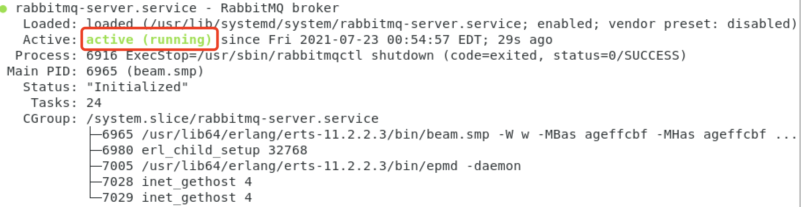

## 在线安装
以 root 用户执行如下命令
```
curl http://git.corilead.com/cplm/cplm-cloud-deploy/raw/master/scripts/quick-start.sh | sh
```
## 离线安装
### 下载安装文件
* [部署脚本](http://git.corilead.com/cplm/cplm-cloud-deploy/-/archive/master/cplm-cloud-deploy-master.zip)
* [OpenJDK](https://download.java.net/java/GA/jdk11/9/GPL/openjdk-11.0.2_linux-x64_bin.tar.gz)
* [MySQL 8](https://dev.mysql.com/get/Downloads/MySQL-8.0/mysql-community-server-8.0.26-1.el7.x86_64.rpm)
* [Elasticsearch]
* [Kibana]
* [MongoDB]
* [Erlang]
* [RabbitMQ](https://packagecloud.io/rabbitmq/rabbitmq-server/packages/el/7/rabbitmq-server-3.8.19-1.el7.noarch.rpm/download.rpm)
* [Redis]
* [Nacos]

## 系统参数
```
sudo sysctl -w vm.max_map_count=262144
sudo sysctl -p
```

### 安装OpenJDK
```
sudo yum install -y java-1.8.0-openjdk-devel
```

### 克隆下载脚本
```
cd ~
git clone --depth 1 http://git.corilead.com/cplm/cplm-cloud-deployment.git
cd cplm-cloud-deployment
```

### MySQL
1. 安装MySQL
```
./install-mysql.sh
```
2. 检查服务状况
```
sudo systemctl status mysqld
```

3. 获取root用户临时密码
```
sudo grep 'temporary password' /var/log/mysqld.log
```
输出消息中包括root用户临时密码，如`A temporary password is generated for root@localhost: 3i>(qm<(g2=W`
4. 修改root用户密码
使用root用户登录
```
mysql  -uroot  -p
```
修改root用户密码
```
ALTER  USER  'root'@'localhost'  IDENTIFIED  BY  'MyNewPass4!';
```
5. 新建数据库实例和用户
```
CREATE DATABASE cplm DEFAULT CHARACTER SET utf8mb4;
CREATE USER 'cplm_user'@'%' IDENTIFIED BY 'cplm_password';
GRANT ALL PRIVILEGES ON cplm.* TO 'cplm_user'@'%';
```

### Elasticsearch
1. 安装Elasticsearch
```
./install-elasticsearch.sh
```
2. 检查服务状况
```
sudo systemctl status elasticsearch
```


### Kibana
1. 安装Kibana
```
./install-kibana.sh
```
2. 检查服务状况
```
sudo systemctl status kibana
```


### Redis
1. 安装Redis
```
cd ~/cplm-cloud-deployment
./install-redis.sh
```
2. 检查服务状况
```
sudo systemctl status redis_6379
```


### RabbitMQ Server
1. 安装RabbitMQ Server
```
./install-rabbitmq-server.sh
```
2. 检查服务状况
```
sudo systemctl status rabbitmq-server
```


### MongoDB
1. 安装MongoDB
```
./install-mongodb.sh
```
2. 检查服务状况
```
sudo systemctl status mongod
```


### Nginx
1. 安装Nginx
```
./install-nginx.sh
```
2. 检查服务状况
```
sudo systemctl status nginx
```

### Nacos
1. 安装Nacos
```
./install-nacos.sh
```
2. 检查服务状况
```
sudo systemctl status nacos
```

3. 导入

