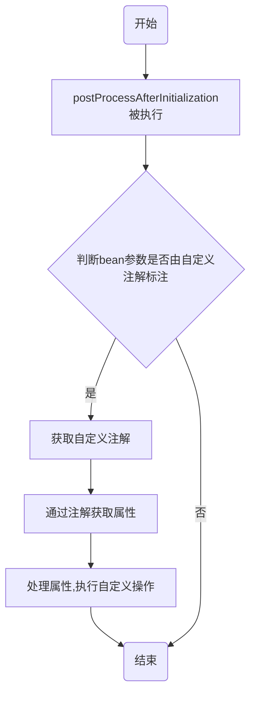

## 概述

## 实现原理及示例

### 新建注解类
该类的主要功能是给要标注的类添加一个标记，后面的程序处理中会读取此标记，完成一些自定义的操作。


3. 专门用来修饰注解的注解叫做元注解，元注解有以下几种：
- @Target : 是专门用来限定某个自定义注解能够被应用在哪些Java元素上面的
- @Retention : 用来修饰自定义注解的生命力(即注明注解在那个生命周期生效)
- @Documented : 用来指定自定义注解是否能随着被定义的java文件生成到JavaDoc文档当中
- @Inherited : 指定某个自定义注解如果写在了父类的声明部分，那么子类的声明部分也能自动拥有该注解。@Inherited注解只对那些@Target被定义为ElementType.TYPE的自定义注解起作用。
```java
import java.lang.annotation.Documented;
import java.lang.annotation.ElementType;
import java.lang.annotation.Retention;
import java.lang.annotation.RetentionPolicy;
import java.lang.annotation.Target;

@Target(ElementType.TYPE)
@Retention(RetentionPolicy.RUNTIME)
@Documented
public @interface ScheduledTask {
  /** 任务名称 */
  String name();
  String group() default "cplm";
  /** 任务描述 */
  String description();
  /** 执行周期 */
  String scheduleRate();
  /** 定时表达式 */
  String cron();
  /** 自定义参数 */
  String params();
  /** 失败重试次数 */
  int failureNum();
  /** 失败重试间隔 */
  int failureInterval();
}
```
>  注解在Java中，与类、接口、枚举类似，因此其声明语法基本一致，只是所使用的关键字有所不同`@interface`

定义注解类型元素时需要注意如下几点：

- 访问修饰符必须为public，不写默认为public；

- 该元素的类型只能是基本数据类型、String、Class、枚举类型、注解类型（体现了注解的嵌套效果）以及上述类型的一位数组；

- 该元素的名称一般定义为名词，如果注解中只有一个元素，请把名字起为value（后面使用会带来便利操作）；

- ()不是定义方法参数的地方，也不能在括号中定义任何参数，仅仅只是一个特殊的语法；

- default代表默认值，值必须和第2点定义的类型一致；

- 如果没有默认值，代表后续使用注解时必须给该类型元素赋值。

在注解上面修饰的注解叫做元注解，java默认的元注解有以下四种：

- @Target : 是专门用来限定某个自定义注解能够被应用在哪些Java元素上面的

- @Retention : 用来修饰自定义注解的生命力(即注明注解在那个生命周期生效)

- @Documented : 用来指定自定义注解是否能随着被定义的java文件生成到JavaDoc文档当中

- @Inherited : 指定某个自定义注解如果写在了父类的声明部分，那么子类的声明部分也能自动拥有该注解。@Inherited注解只对那些@Target被定义为ElementType.TYPE的自定义注解起作用。
### 新建后置处理器（BeanPostProcessor）
```java
import java.util.Objects;
import org.springframework.aop.framework.AopProxyUtils;
import org.springframework.beans.factory.config.BeanPostProcessor;
import org.springframework.core.annotation.AnnotationUtils;

public class ScheduledTaskBeanPostProcessor implements BeanPostProcessor {
  @Override
  public Object postProcessAfterInitialization(Object bean, String beanName) 
    //   因传入的bean有可能为代理类，此方法是获取bean的原始类型
    Class<?> targetClass = AopProxyUtils.ultimateTargetClass(bean);
    //    获取自定义注解
    ScheduledTask annotation = AnnotationUtils.getAnnotation(targetClass, ScheduledTask.class);
    //    如果自定义注解不为空，则表示此类被注解
    if (Objects.nonNull(annotation)) {
      //     从注解中获取属性，进行后续处理
      String cron = annotation.cron();
      String description = annotation.description();
      int failureInterval = annotation.failureInterval();
      int failureNum = annotation.failureNum();
      String group = annotation.group();
      String name = annotation.name();
      String params = annotation.params();
      String scheduleRate = annotation.scheduleRate();
      handleCustom(
          cron,
          description,
          failureInterval,
          failureNum,
          group,
          name,
          params,
          scheduleRate,
          beanName);
    }
    return bean;
  }

  /** 处理自定义操作 */
  private void handleCustom(
      String cron,
      String description,
      int failureInterval,
      int failureNum,
      String group,
      String name,
      String params,
      String scheduleRate,
      String beanName) {}
```
此类的作用是，判断传入的Spring bean是否由自定义注解标注，如果是则获取自定义注解的属性，交由后续的程序处理。

### 新建EnableXXX注解
```java
import java.lang.annotation.Documented;
import java.lang.annotation.ElementType;
import java.lang.annotation.Retention;
import java.lang.annotation.RetentionPolicy;
import java.lang.annotation.Target;
import org.springframework.context.annotation.Import;

@Target(ElementType.TYPE)
@Retention(RetentionPolicy.RUNTIME)
@Import(ScheduledTaskImportSelector.class)
@Documented
public @interface EnableScheduledTask {}
```
由代码可以看出此类的定义和自定义注解基本上相同，主要的区别是使用了@Import注解。@Import注解可以和下文的ImportSelector配合，实现自动配置，导入Spring Bean。
@EnableScheduledTask一般标识在配置类上，在上下文环境中有此注解就会自动配置ScheduledTaskBeanPostProcessor类。

### 新建导入类（ImportSelector）
```java
import org.springframework.context.annotation.ImportSelector;
import org.springframework.core.type.AnnotationMetadata;
import org.springframework.lang.NonNull;

 public class ScheduledTaskImportSelector implements ImportSelector {

  @NonNull
  @Override
  public String[] selectImports(AnnotationMetadata annotationMetadata) {
    return new String[] {ScheduledTaskBeanPostProcessor.class.getName()};
  }
 }
```
此类的重写方法返回ScheduledTaskBeanPostProcessor类的类全名，配合EnableScheduledTask注解实现自动导入ScheduledTaskBeanPostProcessor类，以实现自动配置。

### 使用方法
1、在类上添加自定义注解
```java
import org.springframework.stereotype.Component;

@ScheduledTask(name = "",group = "",description = "",scheduleRate = "",params = "",cron = "",failureInterval = 1,failureNum = 1)
@Component
public class ScheduledTaskConfig {
}
```
> 注意：添加自定义注解以后后面自己写的处理逻辑并没有生效，还需要在启动类或者配置类上添加@EnableXXX注解
2、 在启动类上面添加@EnableXXX注解
```java
import org.springframework.boot.SpringApplication;
import org.springframework.boot.autoconfigure.SpringBootApplication;

@SpringBootApplication
@EnableScheduledTask
public class DemoApplication {

  public static void main(String[] args) {
    SpringApplication.run(DemoApplication.class, args);
  }

}
```


